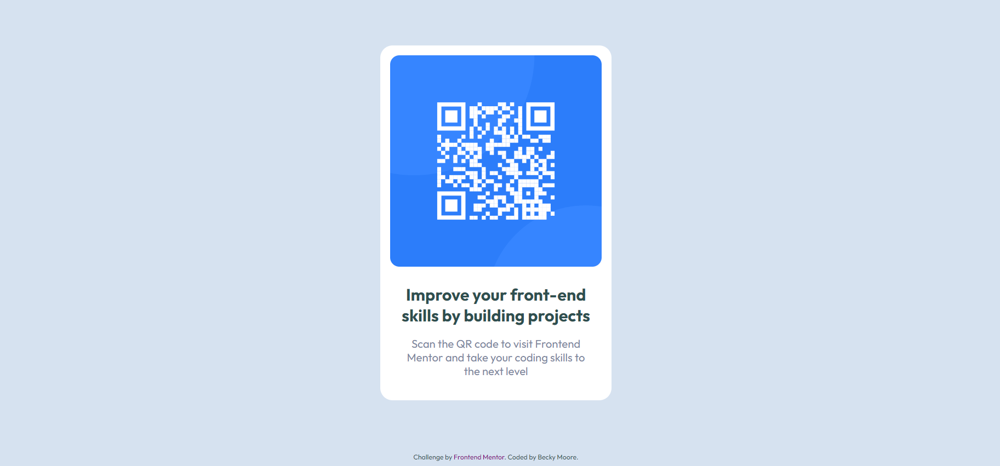

# Frontend Mentor - QR code component solution

This is a solution to the [QR code component challenge on Frontend Mentor](https://www.frontendmentor.io/challenges/qr-code-component-iux_sIO_H). Frontend Mentor challenges help you improve your coding skills by building realistic projects. 

## Table of contents

- [Overview](#overview)
  - [Screenshot](#screenshot)
- [My process](#my-process)
  - [Built with](#built-with)
  - [What I learned](#what-i-learned)
  - [Continued development](#continued-development)
- [Author](#author)

## Overview

### Screenshot

This is a screenshot of my finished project.

## My process

### Built with

- Semantic HTML5 markup
- CSS custom properties
- Flexbox

### What I learned

My first project with HTML & CSS outside of a tutorial. Really good to workout the requirements myself and satisfying to see it come together.

I opted for inline CSS as it is a small project and listed the style attributes for easier reading.

### Continued development

My plan is to work through the Frontend Mentor projects so that I am fluent and confident in using HTML & basic CSS without checking my tutorial notes or looking up the foundational information. 

## Author

- Frontend Mentor - [@MBecky](https://www.frontendmentor.io/profile/MBecky)
